# 航空旅客智能美食推荐系统

> 本项目是我的毕业设计实践项目。核心目标是把“航班信息、旅客偏好、餐食推荐、航后评分”串成一个完整闭环，形成可演示、可迭代、可落地的航空餐食智能推荐系统。


## 1. 项目简介

这套系统分为三端：

- `Spring Boot 3` 后端：承载业务、推荐算法、评分任务、权限与数据闭环
- `Vue3` 管理端：面向运营/管理员，做航班、餐食、公告、评分任务、员工管理
- `UniApp` 小程序端：面向旅客，完成登录、航班绑定、餐食预选、航后评分

本次版本重点实现了：

- 小程序登录页全新视觉升级
- 餐食预选双逻辑（未预选/已预选）
- 航后评分从“单条”升级为“多条列表，用户点击进入评分”
- 后端 `pending-rating` 返回结构从 `Map` 优化为强类型 VO

## 2. 技术栈

### 前端

- 管理端：`Vue3` + `TypeScript` + `Element Plus` + `Pinia` + `ECharts`
- 小程序端：`UniApp` + `Vue3` + `TypeScript` + `Pinia`
- Node 建议：`>=16`（本地使用 `20.11.1`）

### 后端

- `Spring Boot 3.2.5`
- `MyBatis`
- `Redis`
- `MySQL`
- JDK：`17+`
- Maven：`3.9+`

## 3. 系统架构

### 3.1 管理端功能模块

- 航空总览
- 航班运营中心
- 航班管理中心
- 航班餐食中心
- 用户餐食中心
- 餐食资源中心
- 公告管理中心
- 评分管理中心
- 管理人员

### 3.2 小程序用户闭环

1. 微信一键登录
2. 航班绑定/切换
3. 餐食预选（未选与已选双态）
4. 航班结束后进入评分列表
5. 用户主动选择某条评分任务并提交

## 4. 项目结构

```text
aviation-food-recommend/
├─ aviation-food-recommend-springboot3/   # 后端（multi-module）
│  ├─ common/
│  ├─ pojo/
│  └─ server/
├─ aviation-food-recommend-vue3/          # 管理端
├─ aviation-food-recommend-uniapp/        # 小程序端
├─ docs/
│  ├─ readmeimage/                        # README 截图素材
│  └─ sql/
└─ README.md
```

## 5. 快速启动

### 5.1 数据库

1. 创建数据库并执行初始化 SQL
2. 核对后端配置文件数据库连接

关键配置文件：

- `aviation-food-recommend-springboot3/server/src/main/resources/application-dev.yml`

### 5.2 启动后端

```bash
cd aviation-food-recommend-springboot3
mvn -DskipTests package
```

运行 `server` 模块主类即可。

### 5.3 启动管理端

```bash
cd aviation-food-recommend-vue3
npm i
npm run dev
```

### 5.4 启动小程序端

```bash
cd aviation-food-recommend-uniapp
npm i
npm run dev:mp-weixin
```

微信开发者工具导入：

- `aviation-food-recommend-uniapp/dist/build/mp-weixin`

## 6. 核心页面展示

### 6.1 小程序端

#### 微信登录页

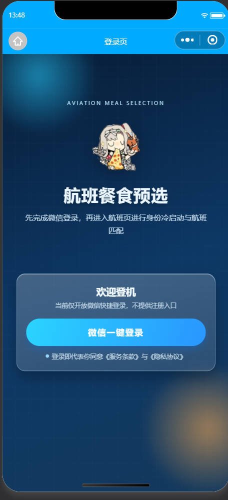

#### 餐食预选页（双态逻辑）

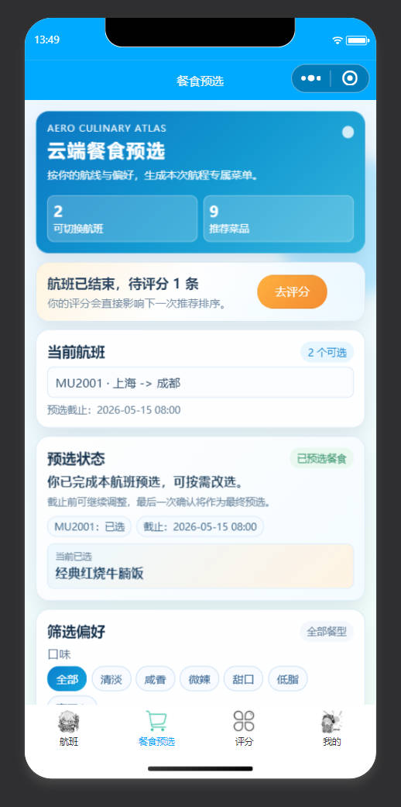

#### 我的页面（状态信息精细化）

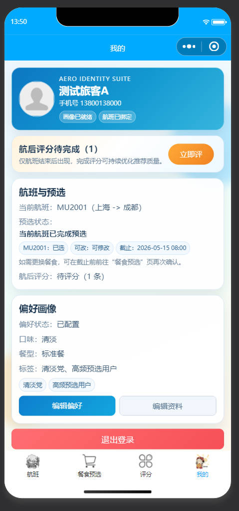

#### 评分列表页

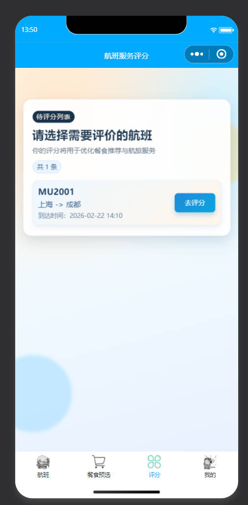

### 6.2 管理端

#### 航空总览

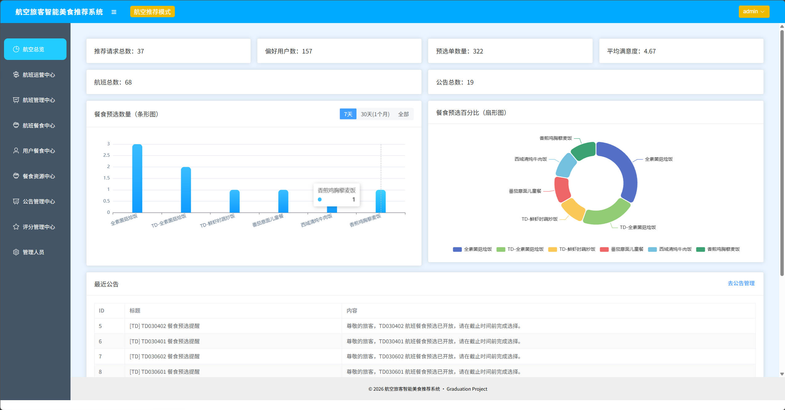

#### 航班运营中心

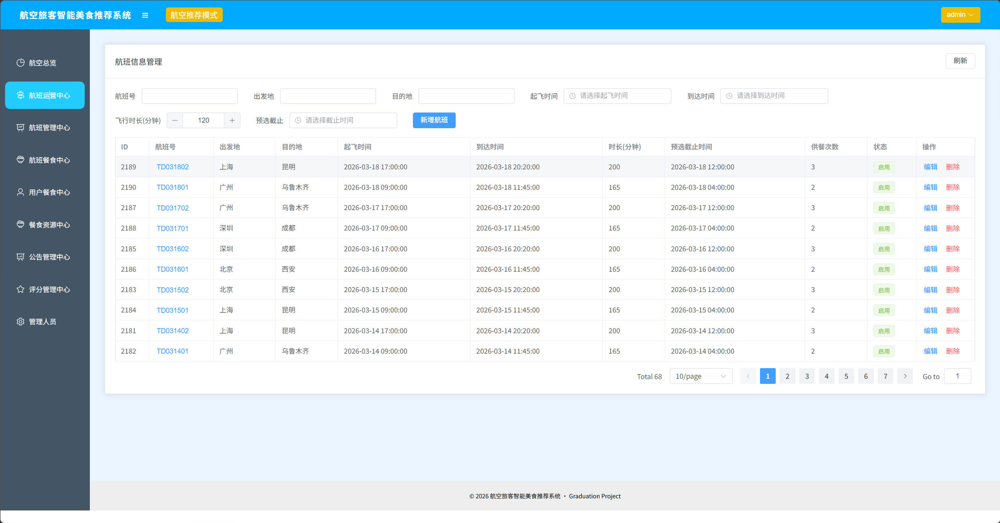

#### 航班管理中心

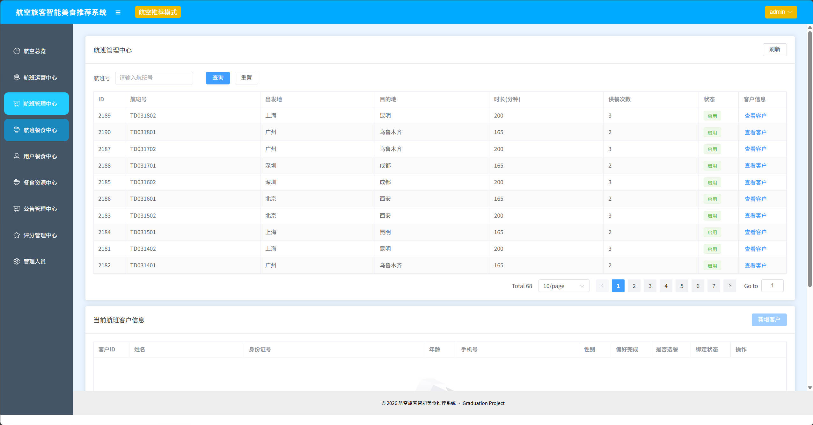

#### 航班餐食中心

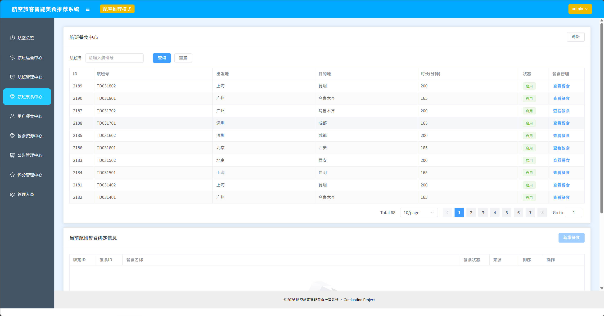

#### 用户餐食中心

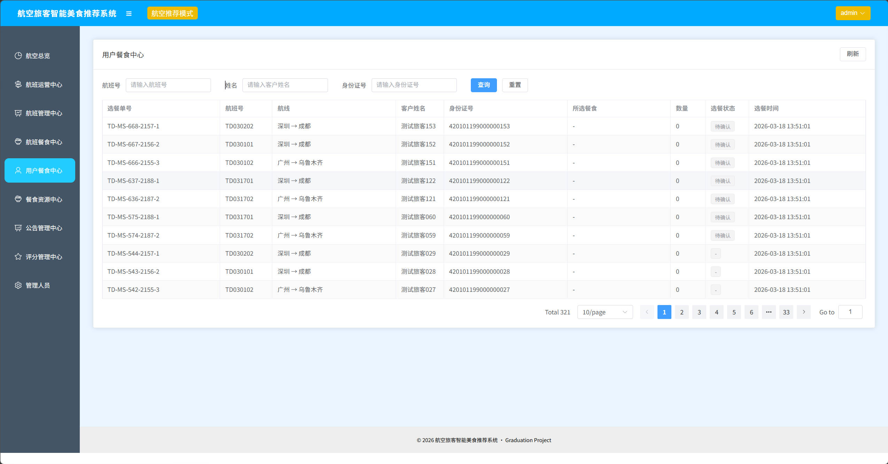

#### 餐食资源中心

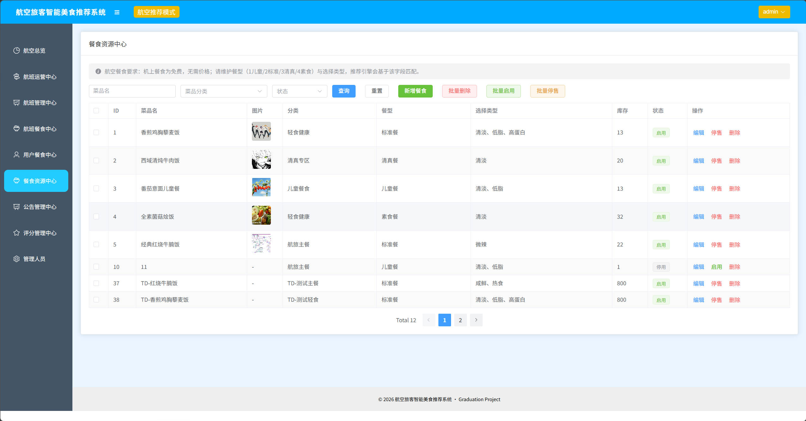

#### 公告管理中心

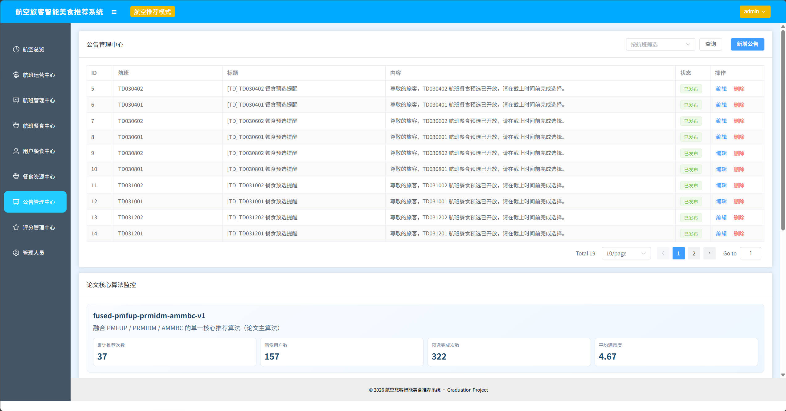

#### 评分管理中心

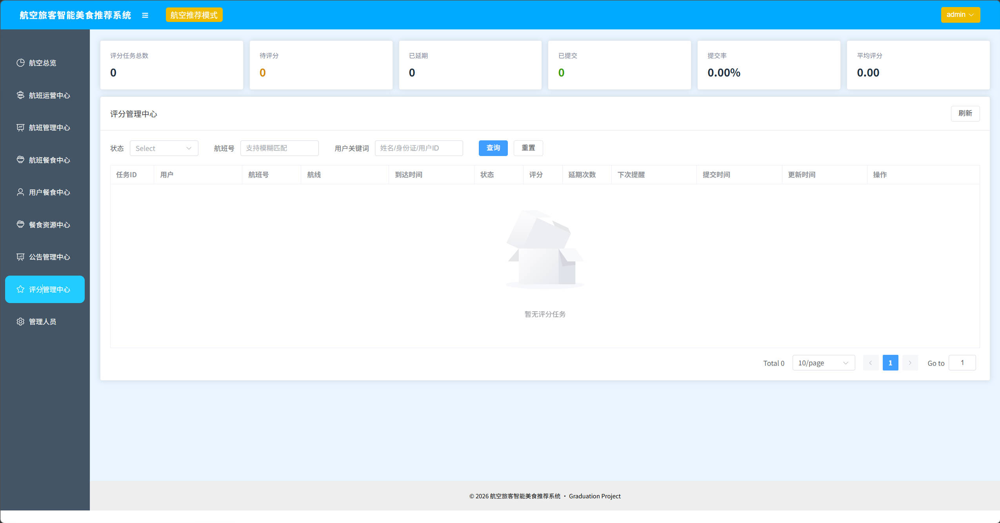

#### 管理人员

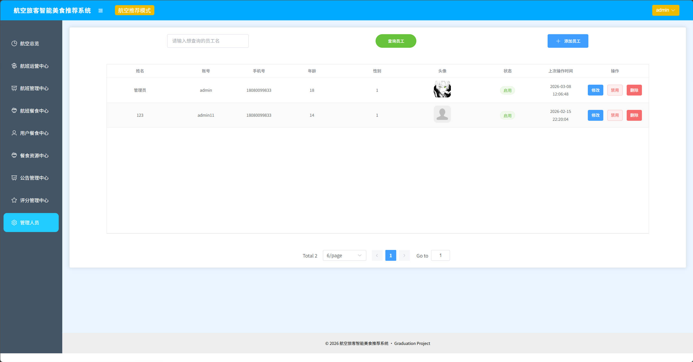

## 7. 关键设计说明

### 7.1 餐食预选双逻辑

- `未预选`：突出“尽快确认”，CTA 为“选择并确认”
- `已预选`：突出“可改选”，展示当前已选餐食，CTA 为“改选并确认”
- `已截止`：禁用选择，展示“等待系统配餐/系统自动配餐”

### 7.2 航后评分多任务机制

- 后端返回多条待评分任务
- 小程序展示列表，用户主动选择某条评分
- 评分完成后即时更新列表，形成可视化闭环

### 7.3 数据类型优化

- 将后端待评分返回结构从 `Map` 迁移到 `PendingRatingInfoVO`
- 降低前后端契约歧义，提升可维护性与可读性

## 8. 开发记录与建议

- VS Code 若偶发 Java 包路径误报，多数是语言服务索引问题，不代表编译失败
- 以 `mvn compile/package` 结果为准，IDEA 与 Maven 一致即可判定代码正确
- 小程序登录依赖微信配置，请确保后端微信参数与环境一致

## 9. 作者说明

我是以“毕业设计可答辩、可演示、可扩展”为标准来推进这个项目的。

这份 README 重点不是堆砌技术名词，而是清楚表达：

- 系统做了什么
- 为什么这么设计
- 现在运行到什么程度
- 后续还能往哪里扩展

如果你正在做同方向毕设，希望这份文档能帮你少踩一点坑。